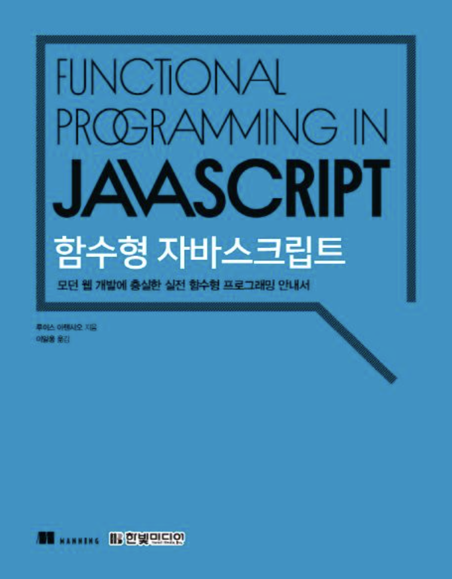

# 함수형 프로그래밍

## 동기 :

 

## [1.함수형 길들이기 :](https://github.com/noy3928/TIL/blob/main/Books/FunctionalJavascript/1.%ED%95%A8%EC%88%98%ED%98%95%EA%B8%B8%EB%93%A4%EC%9D%B4%EA%B8%B0.md)

- 함수형은 유용하다.
- 함수형 프로그래밍이란?
  - 최종 목표 : 1. 부수효과를 방지한다. 2.상태변이를 감소시킨다.
  - 함수형의 기본개념 :
    - 선언적 프로그래밍 : 구현의 세부사항을 드러내지 않고, 연산/작업을 표현하는 사상.
    - 순수함수 : 부수효과가 없는 함수. 똑같은 인수에 무조건 똑같은 결괏값을 반환하는 함수.
    - 참조투명성 : 어떤 함수가 동일한 입력에 동일한 값을 내면 그것을 참조 투명한 함수라고 부른다.
    - 불변성 : 객체나 데이터가 변경되지 않도록 유지하는 것.
- 고수준에서 이해한 함수형 프로그래밍 :
  - 분해 : 함수를 작고 순수한 단위로 쪼갠다. 그리하여 단일한 목적을 가진 함수로 만든다.
  - 합성 : 분해된 함수를 합성한다.

 

### 나의 질문

1. 캡슐화와 선언형 프로그래밍은 어떤 공통점과 차이점이 있는가? :

   - 캡슐화 :
     - 자주 변경되는 녀석을 내부에 감춘다.
     - 자주 변경되지 않는 녀석을 외부에 인터페이스로 공개한다.
     - 세부 사항은 내부에 감춘다.
     - 원하는 동작이 있으면 요청하라고 인터페이스를 공개한다.
   - 선언적 프로그래밍 :
     - 세부 사항을 드러내지 않는 방법으로 코드를 작성한다.
   - 공통점 :
     - 세부 사항이 드러나지 않는다.
   - 차이점 :
   - 목적이 다르다
     - 캡슐화 : 변경사항의 전파를 최소화하는 것이 목적이다.
     - 선언형 : 높은 가독성과 불변성을 유지하는 것이 목적이다.

2. 단일성의 원리와 응집도에는 어떤 공통점과 차이점이 있는가? :

3. 선언적 프로그래밍과 함수형은 어떤 관계가 있는가? :  
   => 선언적 프로그래밍과 불변성은 어떤 관계가 있는가?
