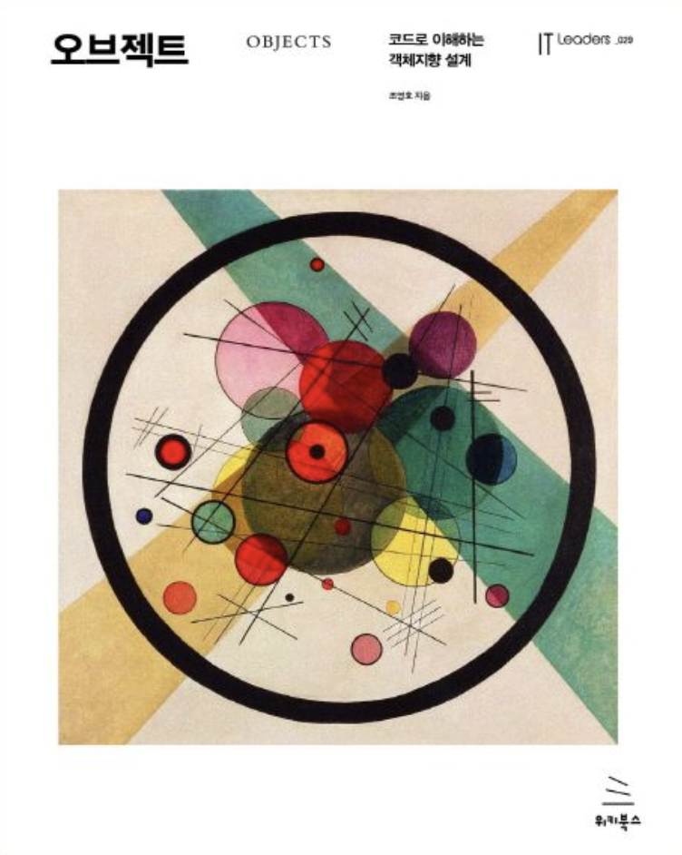

# 오브젝트

 

## 동기 :

## 서문 :

## [2장 - 객체지향 프로그래밍 :](https://github.com/noy3928/TIL/tree/main/Books/Object/2.%EA%B0%9D%EC%B2%B4%EC%A7%80%ED%96%A5%20%ED%94%84%EB%A1%9C%EA%B7%B8%EB%9E%98%EB%B0%8D)

key point는 유연한 설계.  
객체지향을 통해서 유연한 설계를 할 수 있다는 것을 보여준다.  
이 장에서 설명하는 유연한 설계를 위한 객체지향의 키워드는 다형성이다.  
다형성이란 무엇인가는 뒤로하고, 다형성이 왜 유연한 설계에 도움이 되는가?  
다형성이 유연한 설계에 도움이 되는 이유는 다형성이 기본적으로 추상화를 근간으로두고 있기 때문이다. 다형성을 설명해보자면, 동일한 메시지에 다른 메서드를 구현하는 것이다. 그렇다면 동일한 메시지에 대하여 새로운 기능을 추가하려고 할 때, 매우 쉽게 기능을 추가할 수 있다. 이런 이유로 다형성을 고려하며 설계할 때, 우리의 설계는 유연해질 수 있다.

이 다형성을 설명하기 위해서 빠질 수 없는 것이 바로 컴파일 시간 & 실행 시간 의존성이고, 상속이다.  
컴파일 시간 실행 시간 의존성이 다르다는 것은, 코드 수준에서는 추상화되어 있는 클래스를 사용하다가 실행 시점에 비로소 구체적인 클래스를 사용한다는 말이 된다.

상속은 동일한 메시지를 부여하기 위해서 사용된다. 동일한 메시지를 가지고 있다는 것은 동일한 인터페이스를 구현한다는 것이 된다. 동일한 인터페이스를 어떻게 구현하는가? 바로 상속을 통해서 구현할 수 있다. 상속은 부모 클래스가 가지고 있는 구현을 자식에게 그대로 내려보내준다. 그러니까 자식은 부모 클래스가 가지고 있는 메서드와 인터페이스를 그대로 가지고 온다는 것이다. 이를 통해서 자식들은 부모와 동일한 인터페이스를 가질 수 있게되고, 동일한 계층 상에서의 형제 클래스들과 동일한 인터페이스를 가지게 된다. 그리고 각각 형제들이 다른 기능을 수행하고자 할 때, 그 인터페이스에 대해서 약간씩 다르게 기능을 수행하도록 만들면, 동일한 메시지, 다른 메서드의 구현이 완성된다.

그렇지만, 상속을 남발할 수는 없다. 상속의 의의를 명확하게 해야한다. 코드의 재사용을 위해서 상속을 사용하는 것이 아니다. 동일한 인터페이스를 공유하기 위한 목적으로 상속을 사용하는 것이 옳다. 왜냐하면 상속은 2가지 단점을 가지고 있기 때문이다. 1) 캡슐화 위반 2) 유연한 설계를 해침. 이런 이유로 코드를 재사용하고자 한다면, 상속보다는 합성을 사용할 것을 권장한다. 합성은 상속의 단점들을 보완해준다.

결론적으로 프로그래밍을 하다보면 객체들은 서로 협력을 하면서 하나의 공동체를 이루게 된다. 그 공동체가 바로 우리가 구현하는 서비스다. 이 객체들이 협력하려고 할 때, 더욱 유연하게 설계하기 위해서 필요한 것이 다형성이다. 그리고 이 장에서는 다형성이 뭔지, 다형성을 이해하기 위해서 알아야 할 개념들에는 무엇이 있는지를 설명하고 있다.

 

## 6장 - 메시지와 인터페이스 :
