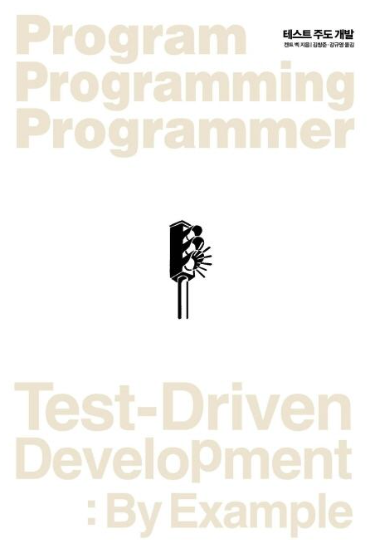

# 테스트 주도 개발

## 동기 :

최근 테스트코드를 작성 중이다. 생각보다 테스트코드를 작성하는 일은 만만한 일이 아니었다.  
아직 나는 TDD를 적용하지도 않았고, 그저 테스트 코드를 작성했을 뿐인데도 쉽지 않은 일이었다.  
그러나 TDD의 명성은 익히 들었고, 그것을 성공적으로 시도해 유익을 누려보고 싶었다.  
그런 와중 테스트코드작성 훈련에 조금 더 동기부여를 받아보고자, 이 책을 읽게 되었다.

 

## [저자의 글 :](https://github.com/noy3928/TIL/blob/main/Books/Test-DrivenDevelopment:ByExample/%EC%A0%80%EC%9E%90%EC%9D%98%EA%B8%80.md)

저자의 글에선 TDD가 가져다주는 가치가 무엇인지 설명한다.  
이것이 궁극적으로 목표하는 바는 "작동하는 깔끔한 코드"  
TDD는 작동하는 깔끔한 코드를 더욱 쉽게 달성하게 도와준다.  
또한 TDD는 개발을 할 때 우리에게 용기를 가져다 준다.

 

## 1부

### [1.다중통화를 지원하는 Money 객체 :](https://github.com/noy3928/TIL/blob/main/Books/Test-DrivenDevelopment:ByExample/1%EB%B6%80-%ED%99%94%ED%8F%90%EC%98%88%EC%A0%9C/1.%EB%8B%A4%EC%A4%91%ED%86%B5%ED%99%94%EB%A5%BC%EC%A7%80%EC%9B%90%ED%95%98%EB%8A%94Money%EA%B0%9D%EC%B2%B4.md)

가장 첫번째 파트에서는 테스트코드를 작성하는 주기를 간단하게 보여준다.  
우선 실패하는 코드를 작성한 후,  
실패하게 만든 리스트를 하나씩 정복해나간다.  
이렇게 정복해야 할 리스트가 곧 해야할 일 목록이다.

 

### [2.타락한 객체 :](https://github.com/noy3928/TIL/blob/main/Books/Test-DrivenDevelopment:ByExample/1%EB%B6%80-%ED%99%94%ED%8F%90%EC%98%88%EC%A0%9C/2.%ED%83%80%EB%9D%BD%ED%95%9C%EA%B0%9D%EC%B2%B4.md)

객체의 부작용에 대한 내용을 다루고 있다.  
불변하지 않은 객체에 대해서 테스트할 때 어떻게 할 것인가 대한 이야기
