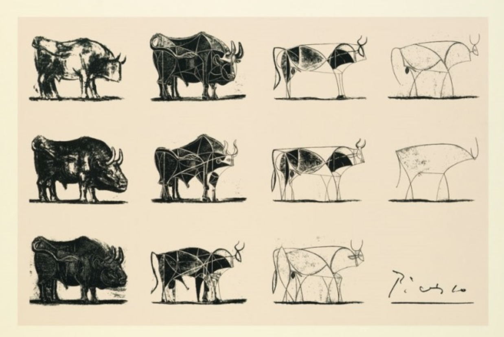
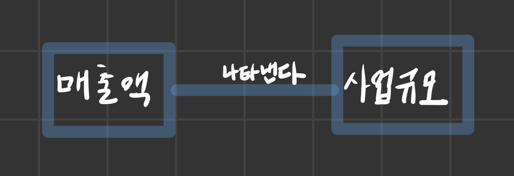

## 사물을 단순화한다

- 피카소의 황소 연작은 황소를 추상화한 그림이다.
- 이 피카소의 황소 연작이야말로 모델을 만드는 과정과 같다.

### 모델을 만든다는 것은 생각한다는 것이다

- 피카소도 한번에 황소를 추상화한 것이 아니다.
- 여러 번 스케치를 수정하면서 황소의 어떤 부분이 본질인지 파악했다.
- 즉, 생각을 위해서 스케치를 하고, 스케치를 함으로써 생각할 수 있다.

- 모델도 마찬가지다.
  - 생각하기 위해 모델을 만들고, 모델을 만듦으로써 깊이 있게 생각할 수 있다구요.

 

### 그림 솜씨가 없더라도 괜찮다

- 모델 기반 사고법에서는 사각형과 연결선만을 사용해 모델을 표현한다

 

## 모델의 기본구조란?

### 모델은 요소와 요소 사이의 관계를 나타낸 것

- 모델로 표현하는 방법의 핵심 :
  - 요소와 요소 사이의 관계를 명확히 하는 것
- 분해하기
  - 이해하기 어려운 대상을 이해하는 방법
  - 복잡한 것을 구성하고 있는 더욱 단순한 요소들로 분해하고, 그 요소들 사이의 관계를 명확히 함으로써 비로소 복잡한 사물을 이해할 수 있게 된다.

 

## 목적을 명확히 하고 관점을 정한다

- 모델을 작성할 때 중요한 점 :
  - 목적과 관점을 명확하게 하는 것
- 분석하려는 목적에 의해 관점이 다르게 된다.
- 어떤 사물에 대한 모델은 유일무이하게 한 개만 존재하는 것이 아니다.
  - 목적과 관점에 따라 다양하게 만들어질 수 있다.

 

## 요소를 추출하여 작성한다

- 모델링에서 가장 바람직한 방법은 각 요소를 모두 찾아내서 열거하는 작업부터 시작해보는 것이다.

 

### 중요한 것을 요소로 만든다

- 복잡한 사물을 구성하는 '중요한 요소들'을 모두 열거해보는 것이 이 단계에서 해야 할 작업이다
  - 무엇이 중요한지는 모델링의 목적과 관점에 따라 달라진다.

 

### 요소는 명사로 작성한다

- 요소는 원칙적으로 명사로 한다.

 

## 관계를 명확히 한다

- 요소를 추출한 다음에는 각 요소 사이의 관계를 찾아낸다.
- 요소와 요소 사이의 관계성을 명확하게 생각하고 그 관계를 사각형과 연결선을 적절하게 사용하여 표현하는 것이다.

### 요소와 요소 사이의 관계를 하나씩 파악해간다

 

## 배치를 조정한다

- 요소를 찾아내고, 관계를 정의하는 것도 중요한데, 같은 수준으로 중요한 작업이 있다.
- 요소를 배치하는 것이다.
- 논리적으로 규칙에 맞게 배치를 조정하는 작업

 

### 같은 그룹 내의 요소들을 가지런하게 배치한다

- 가로 혹은 세로로 가지런하게 나열하여 배치하면 전체 모습을 정렬할 수 있게 된다.

 

---

## COLUMN : UML과 모델 기반 사고법

- 훌륭한 프로그래머는 곧바로 개발을 착수하지 않는다.
- 먼저 어떻게 프로그램을 개발할 것인지를 설계한다.

 
