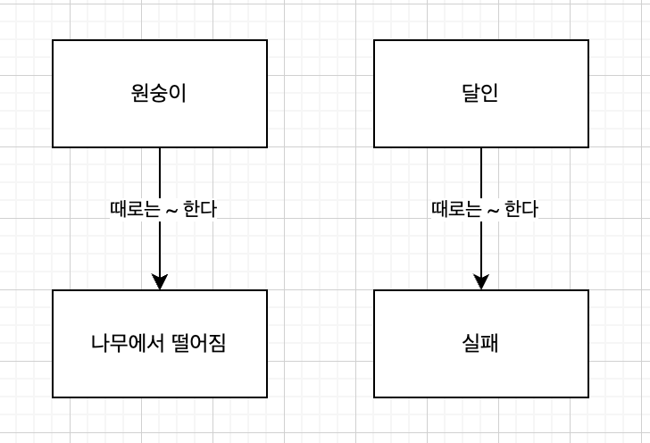
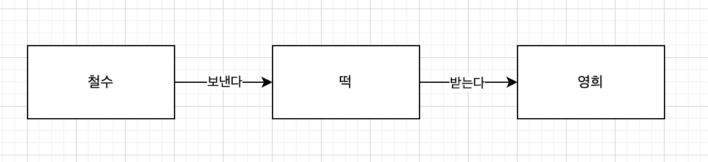
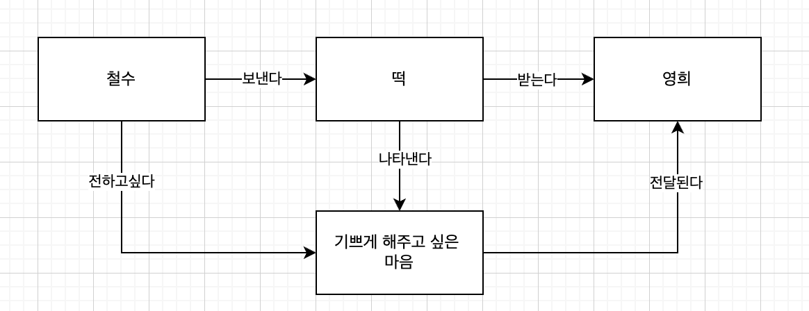
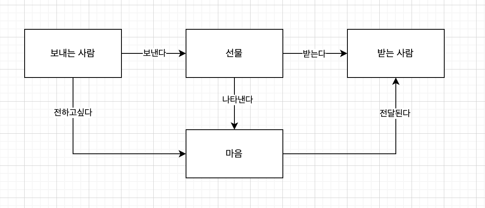

## 원숭이도 나무에서 떨어질 때가 있다

### 요소들을 작성해서 관계를 명확하게 한다

원숭이도 나무에서 떨어질 때가 있다. 라는 속담은  
'달인이라고 하더라도 때때로 실패하는 경우가 있다'는 사실을 표현한 문장이다.
이것을 표현하면 아래와 같다.

하지만 이것은 아직 속담의 본질을 내포하고 있지 못하다.

### 목적을 정해서 다시 도전한다

- 모델을 만들 때는 목적을 충분히 의식해야 한다.
  - 목적에 따라 중요한 요소들을 잘 추출해야한다.
- 위 속담이 무엇을 전달하려는 것인지 충분히 의식하여 중요한 부분을 요소로 추출해야 한다.

 

### 원숭이도 나무에서 떨어질 때가 있다

- 나무
  - '나무' 자체는 그다지 중요하지 않다.
  - 나무에서 떨어진다를 요소로 하면 좋겠다.
  - "나무에서 떨어짐" 이라는 명사로 바꾸어보자.
- 원숭이
  - 달인

 

## 떡보다 마음

'떡 빚기보다 그 마음이 중요하다'라는 속담을 구체적으로 설명해보기 위해  
철수와 영희를 등장시킨다.

이것은 아직 제대로된 모델링이 아니다.  
속담의 본질을 드러내고 있지 못하다

### 모델에 의미를 내장시킨다

- 영희는 왜 기뻤을까?
  - 떡 때문이 아니라, 떡을 빋어준 철수의 마음 때문에 기뻤을 것이다.
- 마음과 떡 사이의 관계는 어떻게 될까?
  - 철수는 떡을 통해 마음을 전달하고자 했다.

이것을 한 차례 더 추상화하면 다음과 같이 표현할 수 있다.

