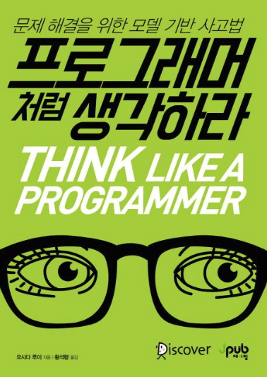

# Think Like a Programmer

## 이 책을 읽기 시작한 이유 :

나는 항상 사고방식에 대해 공부하는 것을 좋아한다.  
그런데 모델링 사고방식이라니? 귀가 솔깃했다.  
서문을 읽어보니, 프로그램을 짤 때 적용되는 모델링 기법을 통해 사고방식까지 확장시키는 것 같았다.  
내가 작성하는 프로그램에서도 모델링을 더욱 잘할 수 있게 도와줄 것 같았고,  
이것을 일상의 사고방식에까지 가져올 수 있을 것 같은 기대감에 책을 주문했다.

 

[서문정리](https://github.com/noy3928/TIL/blob/main/Books/ThinkLikeAProgrammer/intro.md)

## [1장 - 모델이란 무엇인가 :](https://github.com/noy3928/TIL/blob/main/Books/ThinkLikeAProgrammer/1.%EB%AA%A8%EB%8D%B8%EC%9D%B4%EB%9E%80%EB%AC%B4%EC%97%87%EC%9D%B8%EA%B0%80.md)

1장에서는 모델이란 무엇인가를 소개하고 있었다.  
모델이란 쉽게 말하면, 사물을 추상화하여 표현한 것을 말한다.
그렇게 추상화시키는 목적은 쉽고 명확한 의사전달이다.

이렇게 모델이란 무엇인가를 생각해볼 때, 모델은 형식이라고도 말할 수 있다고 하면서,
여러가지 사례들을 소개한다.

그리고 모델기반사고법에서는 어떻게 모델이 사용되는지 잠깐 소개한다.
그리고 2장에서는 모델기반사고법으로 모델을 작성하는 방법을 알아보겠다는 말로 1장을 마무리한다.

 

## [2장 - 모델 작성법 : ](https://github.com/noy3928/TIL/blob/main/Books/ThinkLikeAProgrammer/2.%EB%AA%A8%EB%8D%B8%EC%9E%91%EC%84%B1%EB%B2%95.md)

2장에서는 모델을 작성하는 방법을 소개하고 있다.  
먼저 모델을 작성할 때 알아야 할 전제가 있다.  
모델을 작성하는 분명한 목적을 가져야한다는 것이다.

1. 대상을 이루고 있는 요소들을 찾아내 열거한다.
   - 요소는 명사로 작성한다
2. 각 요소들 사이의 관계를 명확히 정의한다.
3. 일목요연하게 요소들을 배치한다.
