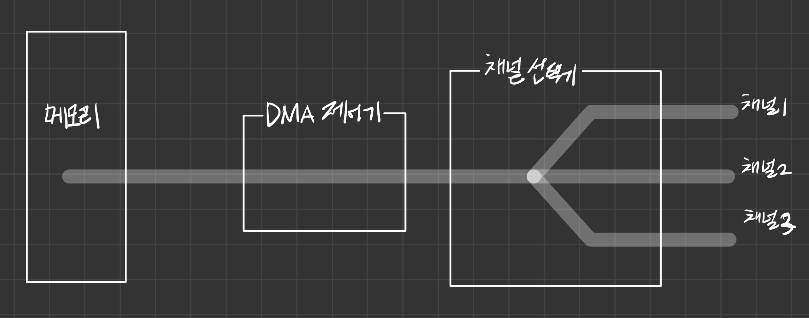

# 입출력 시스템

## 입출력 장치와 채널

컴퓨터는 필수 장치와 주변장치로 구분된다.  
다양한 주변 장치에는 데이터 전송속도에 따라 저속 주변장치와 고속 주변 장치로 나뉜다.

- 저속 주변장치 : 오고가는 데이터의 양이 적어 데이터 전송률이 낮은 장치. 키보드의 경우 아무리 빨라도 1초에 1kb를 넘기지 않으므로 저속 주변장치다.
- 고속 주변장치 : 메모리와 주변장치 사이에 대용량의 데이터가 오고 가므로 데이터 전송률이 높은 장치를 말한다. 그래픽카드의 경우 초당 수십장의 그래픽을 보여줘야 하기 때문에 고속 주변장치이다. 하드디스크도 대용량의 데이터를 메모리에 올리거나 메모리에서 하드디스크로 옮겨야하기 때문에 고속 주변장치다.

### 채널

버스에는 많은 종류의 장치가 연결되어있다. 때문에 버스1개만 사용하면 병목 현상이 생긴다.  
따라서 여러 개의 버스를 묶어서 사용하는데, 이때 하나의 데이터가 지나다니는 통로를 채널이라고 부른다.  
채널은 도로의 차선과 비슷한 개념이다.

### 채널공유 & 채널분리

주변장치는 저마다 데이터 전송 속도가 다르다. 때문에 무분별한 사용은 문제를 일으킨다.  
도로에 트랙터, 화물차, 승용차가 구분없이 다닌다면 느린 트랙터 때문에 문제가 생길 것이다.  
마찬가지로 채널을 효율적으로 사용하기 위해서는 속도가 비슷한 장치끼리 묶어야 한다.  
이것을 채널 분리라고 한다.

 

## 입출력 버스의 구조

### 초기 구조

CPU가 직접 입출력 장치에서 데이터를 가져왔다. 이를 폴링이라고 한다. polling.  
주변장치는 CPU와 메모리보다 매우 느리다. 따라서 폴링 방식을 사용하면 입출력이 끝날때까지 다른 작업을 할 수 없다.

### 입출력 제어기를 사용한 구조

주변장치의 발달로 인해 폴링방식만으로는 관리가 어려워졌다. 때문에 입출력 제어기에게 맡기는 구조로 변경되었다.  
이는 주방 보조를 두어 보관 창고에서 재료를 옮기거나 기름의 온도를 맞추는 일을 시키는 것과 같다.  
이렇게하면 요리사는 요리에만 집중할 수 있다.

입출력 제어기는 메인버스와 입출력 버스라는 2개의 채널로 나뉜다. 메인버스는 CPU와 메모리가 사용하고, 입출력 버스는 주변장치가 사용한다.  
입출력 제어기는 입출력장치로부터 데이터를 직접 송수신한다. 입출력 제어기를 사용하면 느린 입출력 장치로 인해 CPU와 메모리의 작업이 느려지는 것을  
막을 수 있어 전체 작업 효율이 향상된다.

### 입출력 버스의 분리

입출력 중에서도 속도가 다르다. 때문에 고속 입출력 버스와 저속 입출력 버스로 분리하여 운영한다.

#### 채널선택기

고속 입출력 버스에는 고속 주변장치를 연결하고 저속 입출력 버스에는 저속 주변 장치를 연결하며,  
두 버스 사이의 데이터 전송은 채널 선택기가 관리한다.  
예를들어 고속 입출력 버스에서 10번 데이터를 받으면 저속 입출력 버스에서 1번 데이터를 받는 식으로 두 버스의 데이터 전송 속도를 조절한다.

- 그래픽카드는 예외적인 경우다. GPU의 계산능력은 CPU를 능가할 정도이고, 다루는 데이터 또한 고속 입출력 버스로 감당할 수 없다. 그래서 곧바로 메인버스에 연결하여 사용하게 되었다.

#### 포트

주변장치를 컴퓨터에 연결하는 데에는 포트를 사용한다.

 

## 직접 메모리 접근

### 직접 메모리 접근

입출력 제어기는 여러 채널에서 온 데이터를 메모리로 옮기는 역할을 한다.  
그런데, 메모리는 CPU의 명령을 따른다. 따라서 CPU의 도움 없이도 메모리에 접근할 수 있도록  
입출력 제어기에게 권한을 부여했는데 이것이 직접 메모리 접근이다.

### 데이터 흐름

채널 선택기는 여러 채널에서 전송된 데이터 중 어떤 것을 메모리로 보낼지 결정한다.  
이렇게 주변장치에서 전송된 데이터는 DMA 제어기를 거쳐 메모리에 올라간다.  
반대로 메모리에서 주변장치로 데이터를 전송할 때는 DMA 제어기가 메모리에서 데이터를 가져오면 채널 선택기에서 적당한 채널로 전송한다.

### 메모리 맵 입출력

CPU와 DMA가 사용하는 공간이 겹치는 현상이 있었다. 둘 다 메모리가 작업의 공간이었기 때문이다.  
이 문제를 해결하기 위해 메모리 상에서도 입출력을 위한 메모리 공간을 분리해 운영한다.  
메모리 맵 입출력에서는 메인메모리의 주소 공간 중 일부를 DMA 제어기에 할당하여 작업 공간이 겹치는 것을 막는다.

 

## 인터럽트

### 입출력과 인터럽트

입출력 제어기는 CPU에 인터럽트를 보낸다. 언제? 입출력 제어기와 DMA 제어기의 협업으로 작업이 완료되었을 때.  
인터럽트는 주변장치의 입출력 요구나 하드웨어의 이상 현상을 CPU에 알려주는 역할을 하는 신호이다.

#### 인터럽트가 발생하는 경우

- CPU가 요청한 작업을 완료했을 때
- 키보드로 데이터를 입력받았을 때
- 하드웨어에 이상이 발생했을 때
- 네트워크 카드에 새로운 데이터가 도착했을 때

#### IRQ 인터럽트 고유 번호

컴퓨터 시스템에는 다양한 공유의 장치가 있기 때문에 CPU가 인터럽트를 받아도 어떤 장치로부터 받은 인터럽트인지 확인하기가 어렵다.  
그래서 인터럽트 고유 번호가 부여되어 있다.

#### 외부인터럽트 - 하드웨어 인터럽트

외부 인터럽트는 입출력장치로부터 오는 인터럽트 뿐만 아니라 전원이상이나 기계적인 오류 때문에 발생하는 인터럽트를 포함하므로 하드웨어 인터럽트라고도 부른다.

#### 내부인터럽트 - 예외상황인터럽트

한편 숫자를 0으로 나누거나 자신의 주소 공간을 벗어나서 작업하는 것과 같이 프로세스의 오류와 관련된 인터럽트는 내부 인터럽트이다.  
내부인터럽트는 프로세스의 잘못이나 예상치못한 문제 때문에 발생하는 인터럽트이므로 예외상황인터럽트라고 부르기도 한다.

#### 시그널

외부,내부 인터럽트는 사용자의 의지와는 상관없이 발생하는 인터럽트이다. 그러나 사용자가 직접 발생시키는 인터럽트가 있다.  
작동중인 프로세스를 끝내기 위해 ctrl + c 키를 누르거나 kill 명령어를 사용하는 것이 그것이다.  
이런 인터럽트를 시그널이라고 부른다.

### 인터럽트 벡터와 인터럽트 핸들러

#### 인터럽트 벡터

엔터럽트 벡터는 여러 인터럽트 중 어떤 인터럽트가 발생했는지 파악하기 위해서 사용하는 자료구조이다. 인터럽트 벡터의 값이 1이면 인터럽트가 발생했다는 의미이다.

#### 인터럽트 핸들러

인터럽트 핸들러는 인터럽트의 처리 방법을 함수로 만들어놓은 것이다. 운영체제는 인터럽트가 발생하면 인터럽트 핸들러를 호출하여 작업을 한다.  
인터럽트 벡터에는 해당 인터럽트 핸들러를 호출할 수 있도록 인터럽트 핸들러가 저장된 메모리의 주소가 포인터 형태로 등록되어 있다.

 

## 버퍼링

### 버퍼의 역할

버퍼는 속도가 다른 두 장치의 속도 차이를 완화하는 역할을 한다.  
느린 장치의 데이터를 버퍼에 모아 한꺼번에 이동하는 방식으로 작동한다. 이렇게하면 더 효율적이다.

#### 커널에서의 버퍼

커널에서도 버퍼를 사용한다.  
커널이 입출력장치로 보내야 할 데이터를 버퍼에 담아놓으면 입출력 제어기가 커널 버퍼에서 입출력 장치로 데이터를 보낸다.  
커널이 버퍼를 사용하면 **입출력 작업이 완료되기 전에 다른 작업을 할 수 있어 시스템의 성능이 좋아진다.**  
스풀러를 사용하는 프린터의 경우도 마찬가지다.

#### 이중버퍼와 단일버퍼

단일 버퍼보다는 이중 버퍼를 사용하는 것이 버퍼 운용에 유리하다.  
단일 버퍼를 사용하면 데이터를 버퍼에 담는 작업과 버퍼에 있는 데이터를 퍼 가는 작업을 동시에 하기가 어렵다.  
그러나 이중 버퍼를 사용하면 한 버퍼는 데이터를 담는 용도로 사용하고 또 한 버퍼는 데이터를 가져가는 용도로 쓸 수 있어서 유용하다.

\*버퍼에 있는 데이터는 누가 가지고 가는가?? CPU?? 입출력 제어기??

- 검색을 해보니 이런 글을 발견 :
  - A buffer in a computer environment means that a set amount of data will be stored to preload the required data before it gets used by the CPU.
  - 이 글에 의하면 CPU가 데이터를 가지고 가는 것 같다.

### 버퍼 운용시 주의점

#### 버퍼가 데이터를 내보내는 타이밍

버퍼가 꽉 찼을 때 입출력장치로 데이터를 전송하도록 설계되어 있다.

#### 이런 방식의 문제점

버퍼가 다 차지 않으면 데이터가 전송되지 않는다는 문제점이 있다.  
그러다보니 데이터가 버퍼안에 남아있는 상태에서 저장장치를 제거하면  
데이터가 저장되지 않는 문제가 생긴다.

#### 플러시

이런 문제를 해결하기 위해서 강제로 버퍼의 데이터가 저장방치로 옮길 수 있게 하도록 하는데,  
이것을 플러시라고 한다.  
플러시가 일어나면 저장장치의 손상을 방지하기 위해 입출력 장치의 전원이 차단된다.  
유닉스에서는 fflush()라는 명령어를 제공한다.
