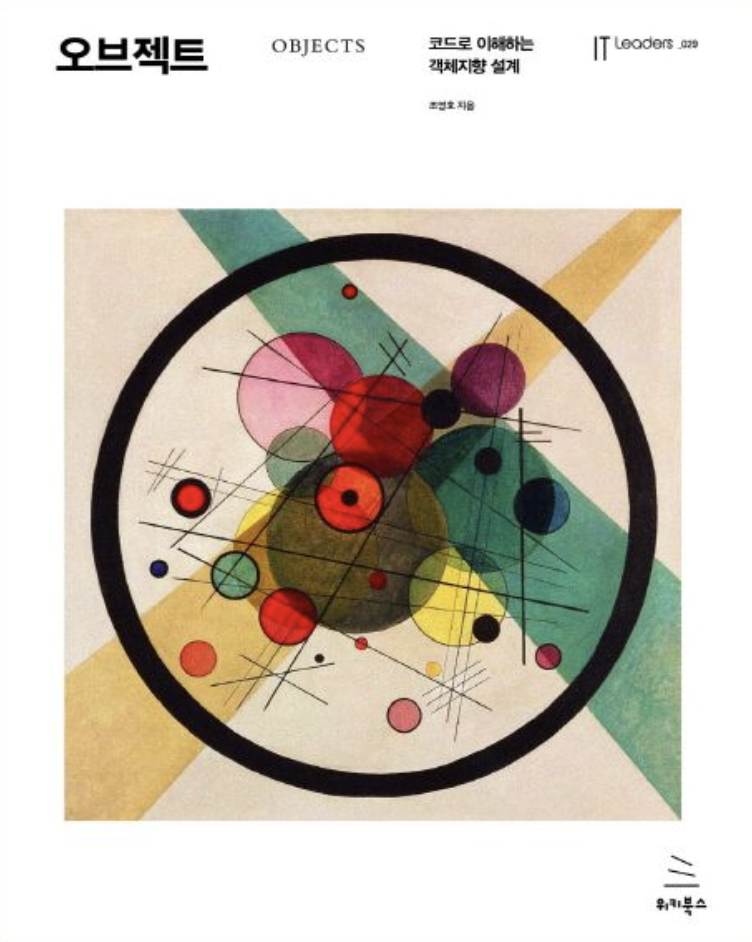

# 오브젝트

 

## 요약 :

### 나만의 정리 : 

### 이 책을 통해서 배운 것 : 

## [2장 - 객체지향 프로그래밍 :](https://github.com/noy3928/TIL/tree/main/Books/Object/2.%EA%B0%9D%EC%B2%B4%EC%A7%80%ED%96%A5%20%ED%94%84%EB%A1%9C%EA%B7%B8%EB%9E%98%EB%B0%8D)

key point는 유연한 설계.  
객체지향을 통해서 유연한 설계를 할 수 있다는 것을 보여준다.  
이 장에서 설명하는 유연한 설계를 위한 객체지향의 키워드는 다형성이다.  
다형성이란 무엇인가는 뒤로하고, 다형성이 왜 유연한 설계에 도움이 되는가?  
다형성이 유연한 설계에 도움이 되는 이유는 다형성이 기본적으로 추상화를 근간으로두고 있기 때문이다. 다형성을 설명해보자면, 동일한 메시지에 다른 메서드를 구현하는 것이다. 그렇다면 동일한 메시지에 대하여 새로운 기능을 추가하려고 할 때, 매우 쉽게 기능을 추가할 수 있다. 이런 이유로 다형성을 고려하며 설계할 때, 우리의 설계는 유연해질 수 있다.

이 다형성을 설명하기 위해서 빠질 수 없는 것이 바로 컴파일 시간 & 실행 시간 의존성이고, 상속이다.  
컴파일 시간 실행 시간 의존성이 다르다는 것은, 코드 수준에서는 추상화되어 있는 클래스를 사용하다가 실행 시점에 비로소 구체적인 클래스를 사용한다는 말이 된다.

상속은 동일한 메시지를 부여하기 위해서 사용된다. 동일한 메시지를 가지고 있다는 것은 동일한 인터페이스를 구현한다는 것이 된다. 동일한 인터페이스를 어떻게 구현하는가? 바로 상속을 통해서 구현할 수 있다. 상속은 부모 클래스가 가지고 있는 구현을 자식에게 그대로 내려보내준다. 그러니까 자식은 부모 클래스가 가지고 있는 메서드와 인터페이스를 그대로 가지고 온다는 것이다. 이를 통해서 자식들은 부모와 동일한 인터페이스를 가질 수 있게되고, 동일한 계층 상에서의 형제 클래스들과 동일한 인터페이스를 가지게 된다. 그리고 각각 형제들이 다른 기능을 수행하고자 할 때, 그 인터페이스에 대해서 약간씩 다르게 기능을 수행하도록 만들면, 동일한 메시지, 다른 메서드의 구현이 완성된다.

그렇지만, 상속을 남발할 수는 없다. 상속의 의의를 명확하게 해야한다. 코드의 재사용을 위해서 상속을 사용하는 것이 아니다. 동일한 인터페이스를 공유하기 위한 목적으로 상속을 사용하는 것이 옳다. 왜냐하면 상속은 2가지 단점을 가지고 있기 때문이다. 1) 캡슐화 위반 2) 유연한 설계를 해침. 이런 이유로 코드를 재사용하고자 한다면, 상속보다는 합성을 사용할 것을 권장한다. 합성은 상속의 단점들을 보완해준다.

결론적으로 프로그래밍을 하다보면 객체들은 서로 협력을 하면서 하나의 공동체를 이루게 된다. 그 공동체가 바로 우리가 구현하는 서비스다. 이 객체들이 협력하려고 할 때, 더욱 유연하게 설계하기 위해서 필요한 것이 다형성이다. 그리고 이 장에서는 다형성이 뭔지, 다형성을 이해하기 위해서 알아야 할 개념들에는 무엇이 있는지를 설명하고 있다.

 

## [6장 - 메시지와 인터페이스 :](https://github.com/noy3928/TIL/blob/main/Books/Object/6.%EB%A9%94%EC%8B%9C%EC%A7%80%EC%99%80%EC%9D%B8%ED%84%B0%ED%8E%98%EC%9D%B4%EC%8A%A4/table.md)

품질 높은 인터페이스를 설계하기 위해서는 내부는 감추면서 꼭 필요한 것만을 드러내도록 해야한다. 이것을 위해서 필요한 원칙들이 있으니, 적절히 사용할 수 있는 안목을 길러 잘 사용하자.

 

## 9장 - 유연한 설계 

유연한 설계를 위한 다양한 원칙을 알아볼 것이다. 여기에는 개방폐쇄원칙, 생성사용분리, 의존성 주입, 의존성 역전 원칙 등이 있다. 하지만 유연성에는 언제나 가독성이라는 트레이드오프가 따르기 때문에 늘 이를 고려하자. 

 

## 10장 - 상속과 코드 재사용 

코드 중복을 해결하기 위해 상속을 사용할 수 있고, 그것을 더 우아하게 사용하는 방법은 있지만, 완전한 해결책은 아니다. 

=> 
코드의 중복은 변경의 여파를 크게 만들기 때문에 언제나 나쁘다. 이 장에서는 코드의 중복을 피할 수 있는 방법으로 상속을 소개하지만, 상속도 사실은 완전 좋은 해결책은 아니다. 그래도 최대한 우아하게 상속하는 방법을 알아보겠다. 최대한 우아하게 상속하는 방법을 알아볼지라도, 상속은 근본적으로 결합도를 높이는 방식으로 설계되기 때문에 코드재사용을 위한 측면에선 좋지 못한 선택지다. 결론은 코드 재사용을 원한다면 합성을 사용해야 한다는 것이다. 
 

## [11장 - 합성과 유연한 설계](https://github.com/noy3928/TIL/blob/main/Books/Object/11.%ED%95%A9%EC%84%B1%EA%B3%BC%20%EC%9C%A0%EC%97%B0%ED%95%9C%20%EC%84%A4%EA%B3%84/table.md) 

10장에서 코드 재사용을 위해서 상속을 사용할 수 있다고 소개했다. 하지만, 상속은 부모-자식 간에 결합도를 높이기 때문에 우아한 방법은 아니었다. 높은 결합도는 유연성을 해치기 때문이다. 그러나, 코드 재사용 & 유연성을 모두 챙길 수 있는 방법이 있으니 바로 합성이다. 11장에서는 실제 코드를 통해서 상속에는 어떤 문제점이 있는지, 이 상속의 코드를 어떻게 합성의 코드로 바꾸고, 그것으로부터 얻을 수 있는 유익은 무엇인지에 대해서 알아본다. 

## [13장 - 서브클래싱과 서브타이핑](https://github.com/noy3928/TIL/blob/main/Books/Object/13.%EC%84%9C%EB%B8%8C%ED%81%B4%EB%9E%98%EC%8B%B1%EA%B3%BC%EC%84%9C%EB%B8%8C%ED%83%80%EC%9D%B4%ED%95%91/table.md) 

13장에서는 상속의 두 가지 용도를 다른 관점에서 설명한다. 상속은 코드의 재사용과, 타입계층을 구현하기 위해서 사용한다. 코드의 재사용은 서브클래싱이라고 부르며, 타입계층을 구현한 것을 서브타이핑이라고 한다. 이렇게 서브타이핑을 구현하기 위해서 필요한 원칙들에는 무엇이 있는지 알아본다. 대표적으로 인터페이스 분리원칙과, 리스코프 치환원칙을 13장에서는 소개하고 있다. 클라이언트가 기대하는 것이 알맞도록, 혹은 행동 호환성이 보장되도록 인터페이스를 분리해야함을 ISP는 이야기하고 있다. 리스코프 치환원칙은 서브타입이 슈퍼타입에 대체될 수 있어야함을 말하는 것인데, 이것 또한 마찬가지로 마찬가지로 행동 호환성을 보장하기 위해서 지켜야하는 원칙이라고 할 수 있다. 
각 SOLID원칙들은 명확하게 구분되어 있는 것이 아니라, 서로 어느정도 겹쳐있는 그레이한 영역이 있다는 깨알같은 깨달음을 얻을 수 있는 장이었다.

## 14장 - 일관성 있는 협력 

14장에서는 일관성 있는 협력이 왜 중요한지, 어떻게 하는지에 대해서 다룬다. 유사한 문제를 해결하는 객체들이 존재한다면, 해당 객체들을 일관성 있게 설계하는 것이 중요하다. 그렇게 할 때, 변경의 여파를 줄일 수 있고, 다른 개발자가 코드를 이해하려 할 때, 훨씬 쉽게 예측하고 이해할 수 있게 된다. 이런 일관성 있는 협력을 만들기 위해서 필요한 기본 개념을 캡슐화다. 변경되는 것과 변경되지 않는 것을 분리하고, 변경되지 않는 것을 추상화한다. 그렇게 추상화된 개념을 통해 협력을 설계한다. 이렇게 추상화된 수준에서 설계한 협력은 구체적인 맥락에 구애받지 않는 일관성 있는 협력이 된다. 실제로 구현하고자 할 땐 구체적인 객체를 통해 협력을 구현하면 된다. 