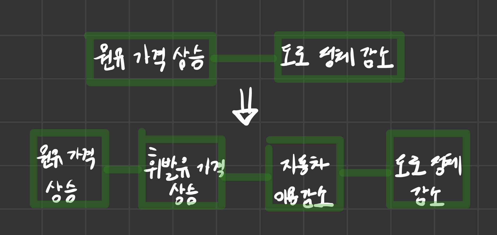

## 모델에는 장점이 많다.

- 도식화의 이점을 누릴 수 있다.
- 전체 모습을 파악할 수 있다.
- 논리적으로 생각할 수 있다.
- 발상을 넓힐 수 있다.

### 정보의 출력 행위가 촉진된다.

- 손을 움직여서 직접 묘사해보면 체험해본 정보가 되어 두뇌에 장기간 남게 된다.

 

### 대상물에 대한 이해가 깊어진다.

- 모델을 제작하는 경우에는 그 대상에 대해 좀 더 깊이 있게 조사하거나 생각해보게 된다.

 

## 도식화의 이점을 누릴 수 있다

- 정보를 신속하게 전달할 수 있다
- 정보를 정리할 수 있다

 

## 전체 모습을 파악할 수 있다

- 모든 정보를 열거하면 무엇이 중요한지 알 수 없다.

### 모델은 요소와 요소 사이의 관계를 시각적으로 나타낸다

- 정보를 개략적으로 내려다볼 수 있다는 점에서 모델은 뛰어나다

 

### 모델은 시간의 흐름에 따라서 변화하는 현상도 표현할 수 있다

- 모델링은 중요한 요소들을 추출하여 상호 관련성을 명확하게 표현하는 작업이다.
  - 일반적으론 정적 현상에 대한 분석을 한다
- 동적인 현상도 표현가능하다

 

## 논리적으로 생각할 수 있다

- 모델을 살펴봐도 전체 모습을 파악할 수 없다면, 그 모델에는 논리적인 비약이 존재한다는 것이다.

 

### 빠짐 없이, 그리고 중복됨 없이 생각할 수 있다

- 모델을 만들면 빠지거나 중복된 것이 없이 사물이 정리되어 있는지 수월하게 확인할 수 있다.

### 논리적 비약을 발견해낼 수 있다

- 원유가격 상승과 도로 정체 감소 사이의 논리적 비약을 발견해 개선한 모델링

 

## 발상을 넓힐 수 있다

- 발상이라는 것은 순간적으로 떠오른 생각뿐만 아니라 고민하여 도출해낸 생각이라는 점이다.

 
